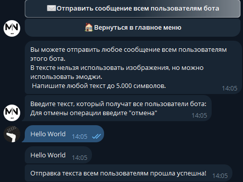

# Poizon Bot

Это телеграм-бот разработанный для расчета стоимости заказа и оформления покупок в китайском интернет-магазине Poizon.

### Функционал

1. **Расчет стоимости заказа**:
   - Пользователь может ввести цену товара в юанях, чтобы определить его стоимость на основном сайте.
   - Выбор товара влияет на стоимость доставки в зависимости от его веса.

2. **Выбор варианта доставки**:
   - После указания цены товара и выбора товара пользователю предоставляется выбор из различных вариантов доставки с указанием стоимости.

3. **Отображение заказа**:
   - После выбора товара и варианта доставки бот предоставляет детализированную информацию о заказе, включая цену товара на Poizon, стоимость доставки, страховку и общую сумму заказа.

4. **Оформление заказа**:
   - После расчета стоимости заказа пользователь может нажать кнопку для перехода к оформлению заказа.
  
5. **Смена языка интерфейса**:
   - Есть возможность выбрать русский или английский язык по нажатию кнопки. Меняется как текст сообщений от бота, так и текст внутри кнопок.
6. **Админ панель**:
   - У определенного пользователя/группы пользователей есть админ панель
   - Изменение курса валюты: Администратор может изменить текущий курс валюты (UAN) через админ-панель.
   - Сброс курса валюты: Позволяет сбросить курс валюты до стандартного значения.
   - Просмотр текущего курса валюты: Показывает текущий курс валюты в боте и на реальной бирже.
   - Просмотр количества активных пользователей: Позволяет администратору узнать общее количество пользователей бота.
   - Отправка сообщений всем пользователям: Позволяет администратору отправить сообщение всем активным пользователям бота.

### Скриншоты
### От лица пользователя:
1. **Меню**:
    
   

2. **Действие "Рассчёт стоимости заказа"**:
    
   

3. **Результат действия "Инструкция"**:
    
   

4. **Выбор категории товаров(Шаг 2)**:
    
   
5. **Выбор способка доставки(Шаг 3)**:
    
   
6. **Вывод сообщения после ответа на все вопросы**:
    
   
7. **Настройки**:
    
   

8. **Меню после смены языка**:
    
   
9. **Подписка/Отписка на рассылку**:
    
   
### От лица Админа:

1. **Меню**:
    
   

2. **Действие "Админ панель"**:
    
   

3. **Действие "Изменить курс валюты"**:
    
   

4. **Действие "Сбросить курс валюты на стандартное значение**:
    
   
5. **Действие "Просмотреть текущий курс на реальной бирже**:
    
   
6. **Дейтвие "Просмотреть общее количество участников бота"**:
    
   
7. **Дейтвие "Сделать рассылку для всех участников"**:
    
   
   
### Демонстрация работы

### Технологии

- **Python**: Основной язык программирования.
- **aiogram**: Фреймворк для создания Telegram ботов.

### Автор

- [@Faunas](https://github.com/Faunas)

